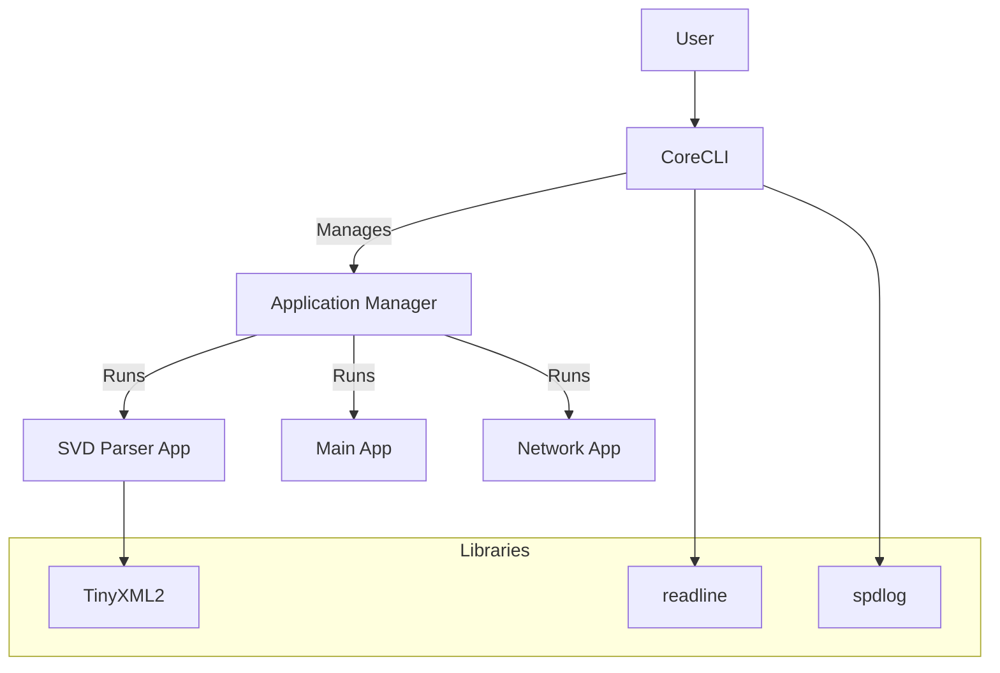
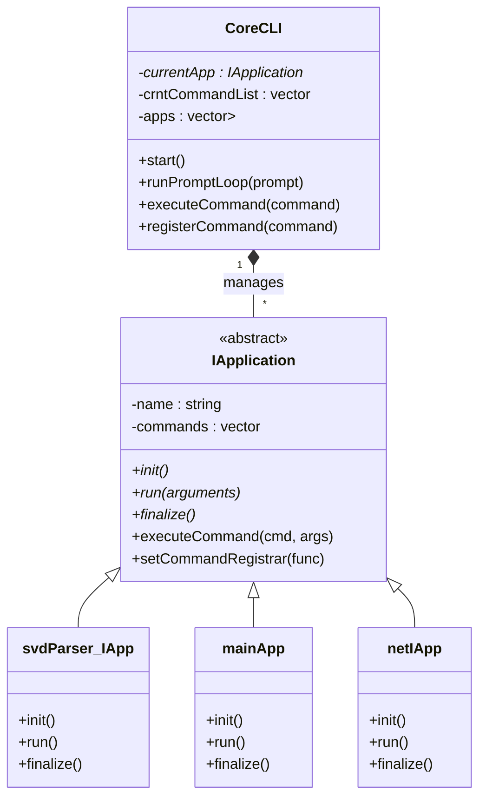
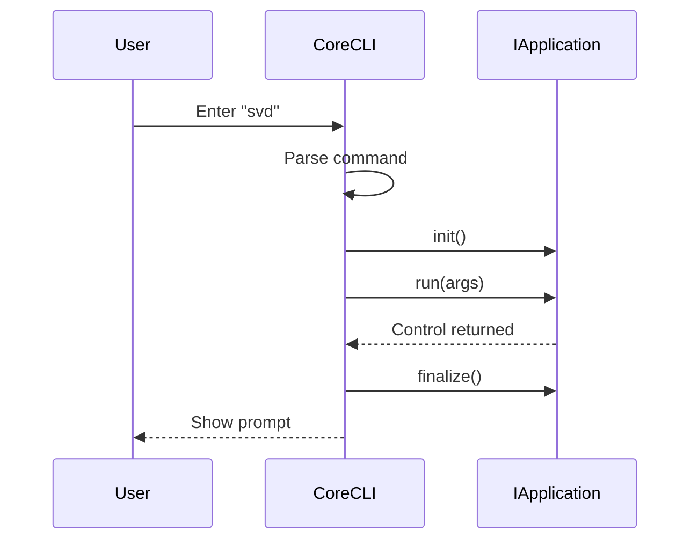

# System Architecture

## Overview
The system is designed as a CLI (Command Line Interface) tool that manages multiple sub-applications. The core component, `CoreCLI`, handles the main prompt loop and delegates execution to registered applications based on user input.

## Diagrams

### Component Diagram

### Class Diagram

### Sequence Diagram - Application Execution

