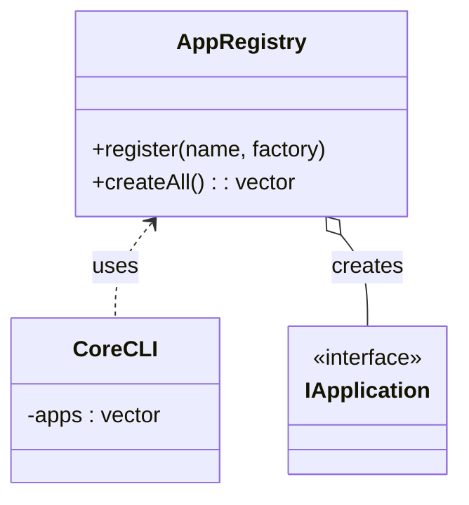
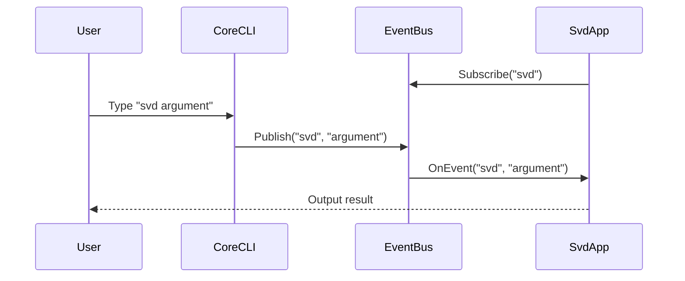

# Proposed Architecture Designs

## Proposal 1: Plugin-Based Architecture (Registry Pattern)

### Concept
Decouple `CoreCLI` from specific application implementations (`svdParser`, `mainApp`) by using a generic Registry or Factory pattern. Applications register themselves at startup (static initialization or dynamic loading), so `CoreCLI` only iterates over the registry.

### Benefits
- **Open/Closed Principle**: Add new apps without modifying `CoreCLI`.
- **Modularity**: Apps can be in separate static libraries or even shared objects (DLLs/SOs) in the future.

### Diagram

### Implementation Details
- Create a `AppRegistry` singleton or static class.
- Use a macro like `REGISTER_APP(MyClass)` to automatically register implementations.

---

## Proposal 2: Event-Driven Architecture

### Concept
move away from "Direct Method Calls" to an "Event Bus". `CoreCLI` publishes a `CommandEvent` (e.g., "User typed 'svd'"). Interested parties (Apps) subscribe to events they care about.

### Benefits
- **Decoupling**: `CoreCLI` doesn't even need to know `IApplication` exists, just that it emits events.
- **Flexibility**: Multiple listeners can react to the same command (e.g., a logger and the actual app).
- **Async Potential**: Easier to move to a thread pool model later.

### Diagram

### Implementation Details
- Introduce an `EventBus` class.
- Apps implement a `Listener` interface or use `std::function` callbacks.
